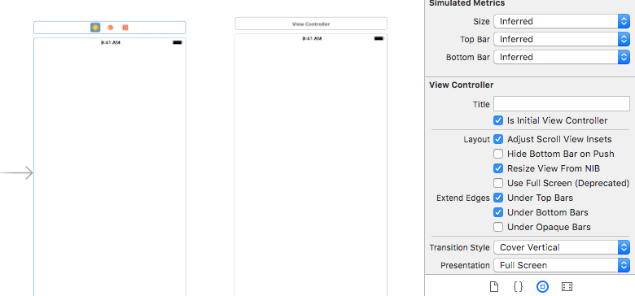
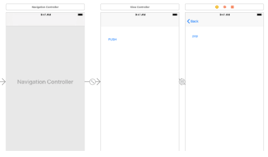

# # How to transition(push, pop)


### # flow

```Swift
//View Trasition : when information continues........

1. Create new ViewController in Storyborad
2. Create new Controller for new View(file->new->file->cocoa class)
3. connect new controller and view (below)

4. Creat Navigation controller of fisst view(Click first View -> Editor -> Enbed in -> Navigation Controller)  
	* with it, back button is automatically created. 

5. make button on first View(push: to go to second view)
6. ctr + drag the button drop on second view, choose show
7. make another button on second view(pop: to go back first view)
8. write method
    @IBAction func popToPrev(){
        self.navigationController?.popViewController(animated: true)
    }
    
 9. connect the method to second button
    touch up inside

```


### # connect controller and view(click left yellow button)- identity inspector tab



### # final

