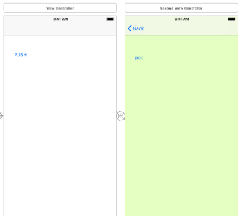

# # View Status Changes(Load, Appear, Disappear)


### # default methods -> remove

```swift
    override func viewDidLoad() {
        super.viewDidLoad()
        // Do any additional setup after loading the view.
    }

    override func didReceiveMemoryWarning() {
        super.didReceiveMemoryWarning()
        // Dispose of any resources that can be recreated.
    }
```


###  # MainViewController

```swift
//
//  ViewController.swift
//  ViewTransition
//
//  Created by 한진탁 on 2018-05-14.
//  Copyright © 2018 jintakhan. All rights reserved.
//

import UIKit

class ViewController: UIViewController {
    
    override func viewDidLoad() {
        super.viewDidLoad()
        //do any additional setup after loading the view, typically from a lib
        // lib : old storyboard name  
        print("ViewController's view is loaded on memory")
    }
    
    override func viewWillAppear(_ animated: Bool) {
        super.viewWillAppear(animated)
        
        print("ViewController's view will appear")
    }
    
    override func viewDidAppear(_ animated: Bool) {
        super.viewDidAppear(animated)
        print("ViewController's view Appeared")
    }
    
    override func viewWillDisappear(_ animated: Bool) {
        super.viewWillDisappear(animated)
        print("ViewController's view will disappear")
    }
    
    override func viewDidDisappear(_ animated: Bool) {
        super.viewDidDisappear(animated)
        print("ViewController's view disappered")
    }
    
    override func viewWillLayoutSubviews() {
        super.viewWillLayoutSubviews()
        print("ViewController's view will layout subviews")
    }
}
```


###  # SecondViewController

```swift
//
//  SecondViewController.swift
//  ViewTransition
//
//  Created by 한진탁 on 2018-05-14.
//  Copyright © 2018 jintakhan. All rights reserved.
//

import UIKit

class SecondViewController: UIViewController {

    override func viewDidLoad() {
        super.viewDidLoad()
        //do any additional setup after loading the view, typically from a lib
        // lib : old storyboard name
        print("second ViewController's view is loaded on memory")
    }
    
    override func viewWillAppear(_ animated: Bool) {
        super.viewWillAppear(animated)
        
        print("second ViewController's view will appear")
    }
    
    override func viewDidAppear(_ animated: Bool) {
        super.viewDidAppear(animated)
        print("second ViewController's view Appeared")
    }
    
    override func viewWillDisappear(_ animated: Bool) {
        super.viewWillDisappear(animated)
        print("second ViewController's view will disappear")
    }
    
    override func viewDidDisappear(_ animated: Bool) {
        super.viewDidDisappear(animated)
        print("second ViewController's view disappered")
    }
    
    override func viewWillLayoutSubviews() {
        super.viewWillLayoutSubviews()
        print("second ViewController's view will layout subviews")
    }
    
    override func viewDidLayoutSubviews() {
        super.viewDidLayoutSubviews()
        print("second ViewController's view layouted subviews")
    }
    
    @IBAction  func popToPrev(){
        self.navigationController?.popViewController(animated: true)
    }
    
    @IBAction func dismissModal(){
        self.dismiss(animated: true, completion: nil)
    }
    

    /*
    // MARK: - Navigation

    // In a storyboard-based application, you will often want to do a little preparation before navigation
    override func prepare(for segue: UIStoryboardSegue, sender: Any?) {
        // Get the new view controller using segue.destinationViewController.
        // Pass the selected object to the new view controller.
    }
    */

}

```





###  # Console

```swift
// when you run APP
ViewController's view is loaded on memory
ViewController's view will appear
ViewController's view will layout subviews
ViewController's view Appeared

// when you click push to go to second view
second ViewController's view is loaded on memory
ViewController's view will disappear
second ViewController's view will appear
second ViewController's view will layout subviews
second ViewController's view layouted subviews
ViewController's view disappered
second ViewController's view Appeared

//when you click pop to go back to first view
second ViewController's view will disappear
ViewController's view will appear
second ViewController's view disappered
ViewController's view Appeared
```

