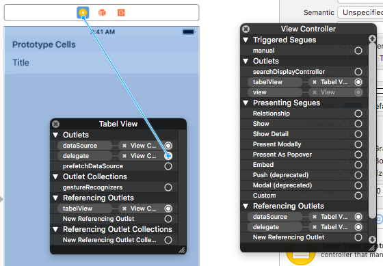

# # Table View


### # summary

1. Add TableVIew and TableCell in storyboard
   1. cell -Style : Basic, Identifier : cell
2. extends  UITableViewDelegate, UITableViewDataSource
3. Create Viewtable code(drag and drop)
4. Create delegate in storyboard
   1. ctr + click Tableview 
   2. Connect outlets to Viewcontroller



5. add code below

```swift

    @IBOutlet weak var tabelView: UITableView!
    
    let cellIdentifier: String = "cell"
    let korean: [String] = ["가","나","다","라","마","바","사","아","자","차","카","타","파","하"]
    let english: [String] = ["A","B","C","D","E","F","G","H","I","J","K","L","M","N","O","P","Q","R","S","T","U","V","S","X","Y","Z",]

    
//    2 sections needed
    func numberOfSections(in tableView: UITableView) -> Int {
        return 2
    }
    
    // how many rows needed
    func tableView(_ tableView: UITableView, numberOfRowsInSection section: Int) -> Int {
        switch section {
        case 0:
            return korean.count
        case 1:
            return english.count
        default:
            return 0
        }    }
    
    // return the cell of the row :
    func tableView(_ tableView: UITableView, cellForRowAt indexPath: IndexPath) -> UITableViewCell {
        //reuse of cell
        let cell: UITableViewCell = tableView.dequeueReusableCell(withIdentifier: self.cellIdentifier, for: indexPath)
        
        //data setting
        let text: String = indexPath.section == 0 ? korean[indexPath.row] : english[indexPath.row]
        cell.textLabel?.text = text
        
        return cell
    }
    
    // insert contents
    func tableView(_ tableView: UITableView, titleForHeaderInSection section: Int) -> String? {
        return section == 0 ?  "korean1" : "english1"
    }
    
```


+ Making grouped table view -> click tableView, style : grouped