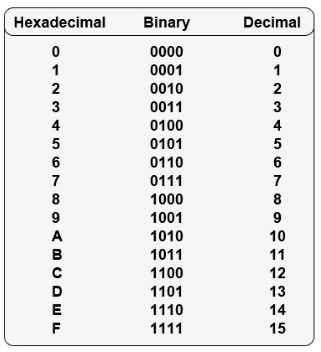
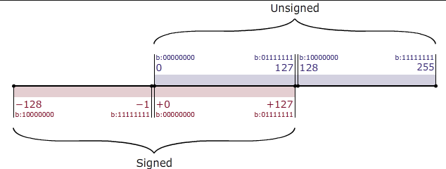

# Binary, Hexadecimal, Decimal

- https://www.rapidtables.com/convert/number/hex-to-decimal.html

  

- Compare

  

- Signed, unSigned

  

# Hex to Decimal converter

1byte = 8bit  = 2^3

1Kb =  1024 bytes = 2^10

- HEXA(0 - 9 - A - F )

  F = F x 16^0  = 15

  11 = 1 x 16^1 + 1 x 16^0 = 17

  1F = 31 

  11 = 17

  FF = 255 = 2^8 = 2^4 x 2^4

  - color : #FFFFFF = FF FF FF = R G B = R(0 ~ 255)

  

